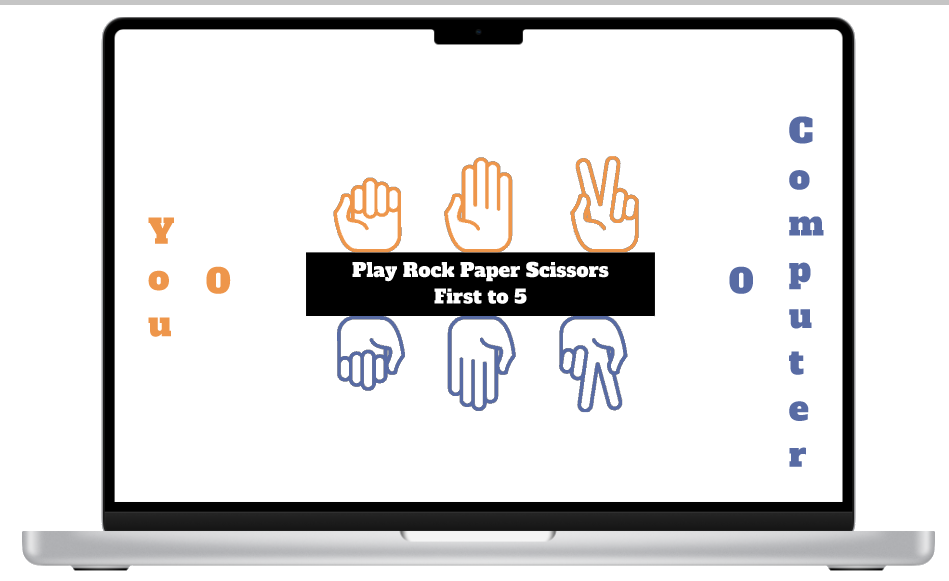

# rock-paper-scissors

## Purpose
The rock paper scissors game implemented in JavaScript as part of [The Odin Project](https://theodinproject.com) curriculum.

## Live Version

https://mogoatlhe.github.io/rock-paper-scissors/

## Challenges Encountered

### Design
I spent most of the time trying to figure out how I wanted it to look. I had to revisit the flexbox notes to get it to look the way I wanted it.

### JavaScript
Nothing challenging yet

## Crediting Image Providers

I found the black and white icons for the game [here]("https://thenounproject.com/browse/icons/term/rock-paper-scissors/?iconspage=1")